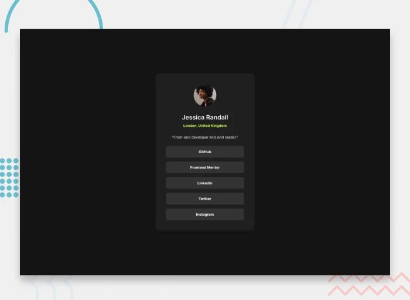

# Frontend Mentor - Social links profile solution

This is a solution to the [Social links profile challenge on Frontend Mentor](https://www.frontendmentor.io/challenges/social-links-profile-UG32l9m6dQ).

## Table of contents

- [Frontend Mentor - Social links profile solution](#frontend-mentor---social-links-profile-solution)
  - [Table of contents](#table-of-contents)
  - [Overview](#overview)
    - [Screenshot](#screenshot)
    - [Links](#links)
    - [Built with](#built-with)
    - [Key Features](#key-features)
  - [How to Use](#how-to-use)
  - [Contributing](#contributing)
  - [License](#license)
  - [Author](#author)

## Overview

This project is a simple social links profile page built as a challenge from Frontend Mentor. It showcases basic information about a person along with links to their social media profiles.

### Screenshot



### Links

- Solution URL: [Social Links Profile](https://www.frontendmentor.io/solutions/responsive-social-links-profile-htmlcss-fWpdCXLrMy)
- Live Site URL: [Social Links Profile](https://dz-social-links-profile.netlify.app/)

### Built with

- Semantic HTML5 markup
- CSS3
  - FlexBox
  - Responsive design

### Key Features

- The page is fully responsive and works on all screen sizes.
- The page is built using semantic HTML5 markup.
- The page is styled using CSS3 and FlexBox.

## How to Use

1. **Clone the repository**:

First, you'll need to clone this repository to your local machine. Open your terminal and run the following command:

```git
git clone https://github.com/hichamweblog/FEM-Social-Links-Profile.git
```

2. **Navigate to the Project Folder**:

Change your working directory to the newly cloned project folder:

```git
 cd FEM-Social-Links-Profile
```

3. **Install Dependencies**:

Install the required packages by running:

```git
npm install
```

4. **Run the project**:

```git
npm run dev
```

This command will launch a development server, and you'll be able to view the website locally in your web browser.

## Contributing

If you would like to contribute to this repository, feel free to open issues or submit pull requests. Contributions and improvements are always welcome.

## License

This project is licensed under the [MIT License](./LICENSE).

## Author

- Frontend Mentor - [@hichamweblog](https://www.frontendmentor.io/profile/hichamweblog)
- Twitter - [@hichamweblog](https://www.twitter.com/hichamweblog)
